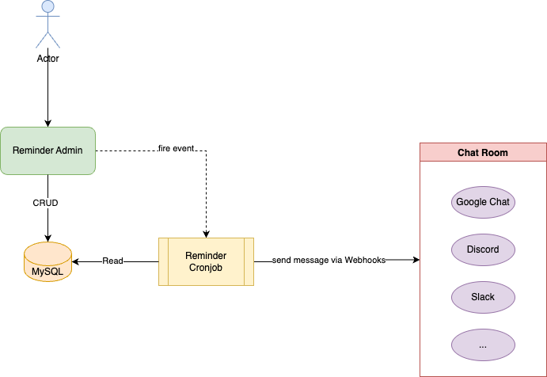
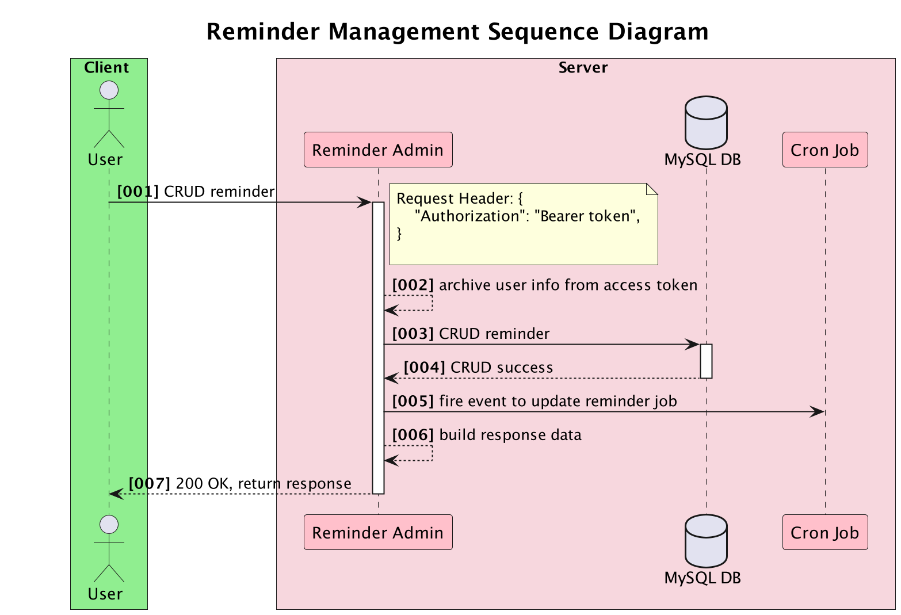
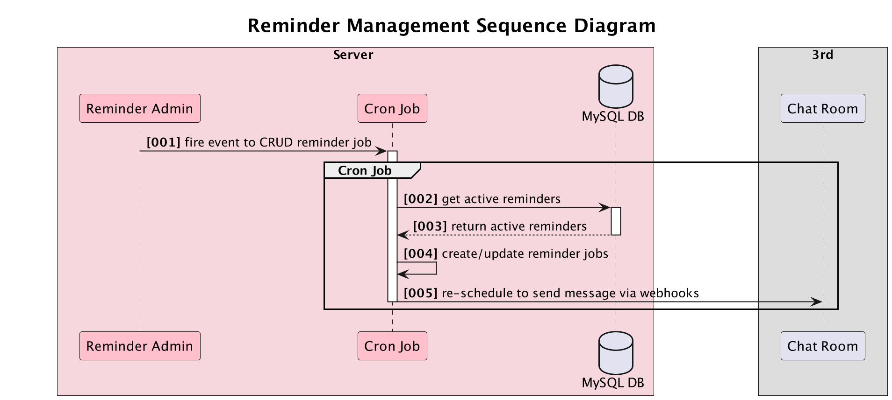

# Reminder Bot Technical Document

## I. Overview

Reminder Bot is a user-friendly bot equipped with an intuitive admin UI that allows users to effortlessly manage their work reminders.   

Using a scheduler, the bot efficiently sends reminder messages via Webhooks, ensuring timely notifications for important tasks and deadlines.   

With its simplicity and effectiveness, Reminder Bot enhances productivity and helps users stay organized in their work routines.  
* Reminder Bot: https://reminderbot.luciango.com/admin
* Github: https://github.com/luannt2909/go-reminder-bot
* Guideline: https://blog.luciango.com/post/how-to-setup-a-simple-reminder-bot
## II. System Architecture

### 1. Architecture Component

#### Table component
| Component        | Description                                        |
|------------------|----------------------------------------------------|
| User             | User                                               |
| Reminder Admin   | Admin Dashboard for reminder management            |
| Reminder CronJob | Cronjob to execute send message via Webhook        |
| MySQL            | Database storage                                   |
| Room Chat        | Chat room such as: Google Chat, Discord, Slack,... |

## III. UseCases And Diagrams

### 3.1 Reminder Management
PlantURL: [Reminder Management Sequence Diagram] (diagrams/reminder_management_sequence_diagram.puml)

### 3.2 Cronjob Reminder
PlantURL: [Reminder CronJob Sequence Diagram] (diagrams/reminder_cronjob_sequence_diagram.puml)


## IV. Database Schema
### Reminder Table 

| Field        | Type   | PK  | Example                    | Description                       |
|--------------|--------|-----|----------------------------|-----------------------------------|
| ID           | int    | x   | 1                          |                                   |
| name         | string | x   | Daily task report          |                                   |
| schedule     | string |     | * * * * *                  | cron schedule to execute reminder |
| message      | string |     | ...                        |                                   |
| webhook      | string |     | https://googlechat.com/... |                                   |
| webhook_type | int    |     | 1                          | 1: google_chat, 2: discord, ...   |
| is_active    | bool   |     | true                       | active/inactive reminder          |
| created_by   | string |     | admin                      |                                   |
| created_at   | int    |     | 1688616552                 |                                   |
| updated_at   | int    |     | 1688616552                 |                                   |
| deleted_at   | int    |     | 1688616552                 |                                   |

### User Table
| Field      | Type   | PK  | Example    | Description |
|------------|--------|-----|------------|-------------|
| ID         | int    | x   | 1          |             |
| email      | string |     |            |             |
| password   | string |     |            |             |
| created_at | int    |     | 1688616552 |             |
| updated_at | int    |     | 1688616552 |             |
| deleted_at | int    |     | 1688616552 |             |

## V. API Specification
Please see more at: [swagger](https://swagger.io/)
### Base URL
| Env         | Host                                    | 
|-------------|-----------------------------------------|
| PRODUCTION	 | https://reminderbot.luciango.com/api/v1 |

### Base Header
| Field          | Type              | Example Value     | Description  |
|----------------|-------------------|-------------------|--------------|
| Authorization	 | string (required) | "Bearer {Token}"	 | access token |

### Format Response
<table>
<tr>
<td> Success Response </td>
<td>

```json
{
  "code": 1,
  "message": "Thành công!",
  "data": [
    {
      "reminder_id": 1,
      "reminder_name": "Daily Task Report"
    }
  ],
  "trace_id": "924eb75d758a13b41aaecd6ce462ac01"
}
```

</td>
</tr>


<tr>
<td> Error Response </td>
<td>

```json
{
  "code": -1,
  "message": "Bad Request",
  "error": {
    "code": -1,
    "message": "invalid reminder id"
  },
  "trace_id": "b2a4e254db32d6a44152e0243a3e9c83"
}
```

</td>
</tr>
</table>

### Error Code
| error_code | Error                 | Description |
|------------|-----------------------|-------------|
| 1	         | SUCCESS               |             |
| 0	         | UNKNOWN               |             |
| -1         | BAD_REQUEST           |             |
| -2         | NOT_FOUND             |             |
| -3         | AUTHENTICATION_FAILED |             |
| -4         | INTERNAL_SERVER_ERROR |             |

## VI. Deployment

### Reminder Bot
| Resource     | Description                                   |
|--------------|-----------------------------------------------|
| Sourcecode   | https://github.com/luannt2909/go-reminder-bot |
| Service name | reminder-bot                                  |
| Type         | Admin Dashboard                               |
| Connection   | RESTAPI                                       |
| Database     | MySQL                                         |
| Cache        | Redis                                         |
| Tracing      | Jaeger                                        |
| Monitoring   | Prometheus                                    |
| ENV file     | .env                                          |
| CMD          | CMD ["./main", "admin"]                       |

### Environment Variables
```dotenv
PRODUCTION=true
PORT=2909
JWT_SIGNING_KEY=XXX
DB_CLIENT="mysql"
DB_CONNECTION_URI="root:root@tcp(127.0.0.1:3306)/reminder_bot"

## JAEGER FromEnv variable
JAEGER_AGENT_HOST="127.0.0.1"
JAEGER_AGENT_PORT="6832"
JAEGER_SAMPLER_TYPE="const"
JAEGER_SAMPLER_PARAM=1

# ----------- PROMETHEUS-----------
PROM_ENABLE = true
PROM_SERVICE_NAME = "reminder-bot"
PROM_METRICS_PORT=9090
```

## Furthermore
